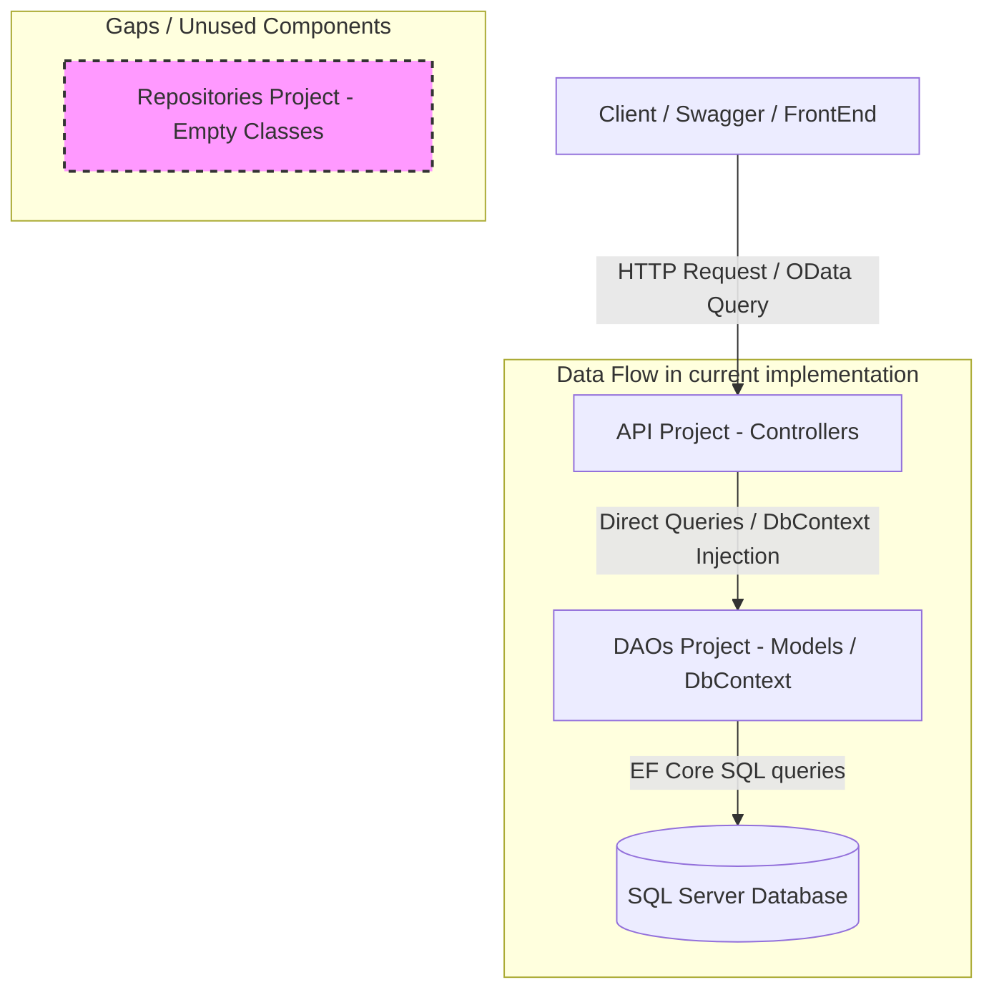

# CODE REVIEW PREPARATION & Q&A CHEAT SHEET
## Tài Liệu Ôn Tập & Bảo Vệ Source Code (FUNews Management System Backend)

Tài liệu này được biên soạn nhằm giúp bạn hiểu sâu sắc toàn bộ codebase hiện tại, cấu trúc thiết kế, các luồng xử lý dữ liệu và chuẩn bị cho các câu hỏi chất vấn từ giảng viên trong buổi bảo vệ/review source code.

---

## 1. Tổng Quan Kiến Trúc Hệ Thống (Architecture Overview)

Hệ thống được thiết kế theo mô hình kiến trúc **3-Tier/N-Tier** phân tầng truyền thống trong hệ sinh thái .NET 8. Tuy nhiên, trong quá trình triển khai thực tế, có một số điểm khác biệt lớn giữa thiết kế ban đầu và logic code chạy.

### Cấu Trúc Thư Mục và Nhiệm Vụ Từng Project
Giải pháp (Solution) `NguyenPhanHuy_SE18D05_BE.sln` bao gồm 3 dự án thành phần:

1. **`DAOs` (Data Access Objects / Data Layer)**:
   - **Thư mục `Models/`**: Chứa các entity classes (`Category.cs`, `NewsArticle.cs`, `SystemAccount.cs`, `Tag.cs`) đại diện cho các bảng trong database. Các entity này được generate theo phương pháp **Database-First** thông qua Entity Framework Core.
   - **`FUNewsManagementContext.cs`**: Class kế thừa từ `DbContext`, chứa cấu hình kết nối database, các `DbSet` để tương tác dữ liệu và cấu hình Fluent API mapping quan hệ giữa các bảng.
2. **`Repositories` (Business & Repository Layer - Đang trống)**:
   - Chứa `INewsRepository.cs` và `NewsRepository.cs`. 
   - > [!WARNING]
     > **Điểm bất thường quan trọng**: Hiện tại hai file này hoàn toàn trống rỗng (empty). Tầng Repository này đã bị bypass hoàn toàn trong code thực tế.
3. **`API` (Presentation Layer)**:
   - Chứa các **Controllers** (`AccountController.cs`, `AuthController.cs`, `CategoryController.cs`, `NewsArticleController.cs`, `TagController.cs`) để tiếp nhận HTTP requests và trả về dữ liệu JSON.
   - Chứa các **DTOs** (Data Transfer Objects) để ánh xạ dữ liệu đầu vào từ Client, đảm bảo không phơi bày cấu trúc Entity trực tiếp.
   - **`Program.cs`**: File cấu hình khởi tạo ứng dụng, đăng ký Dependency Injection (DI), cấu hình Authentication/Authorization (JWT), OData, Swagger và Middleware.

### Các Design Patterns Áp Dụng
* **Dependency Injection (DI)**: Đăng ký các dịch vụ như `FUNewsManagementContext`, cấu hình JWT, và OData vào IoC Container thông qua `builder.Services` trong `Program.cs`. Sau đó inject trực tiếp vào Controller thông qua Constructor.
* **Data Transfer Object (DTO)**: Sử dụng các class trong thư mục `DTOs/` để kiểm soát dữ liệu client gửi lên (Ví dụ: `NewsArticleDTO` thay vì gửi trực tiếp `NewsArticle`).
* **Unit of Work (Implicit)**: EF Core `DbContext` đóng vai trò là một Unit of Work, quản lý việc theo dõi thay đổi (change tracking) và cam kết transaction thông qua `SaveChangesAsync()`.
* **Fluent API**: Định nghĩa quan hệ và ràng buộc dữ liệu tại phương thức `OnModelCreating` trong `FUNewsManagementContext.cs`.

---

## 2. Bản Đồ Luồng Xử Lý Chính (Code Map & Flow Analysis)

### 2.1. Luồng Xác Thực (Authentication) & Cấp JWT Token
* **Vị trí xử lý chính**: `AuthController.cs` tại [AuthController.cs:L27-L80](file:///d:/Users/huynpde180519/fpt/SUMMER_26/PRN232/NguyenPhanHuy_SE18D05_BE/API/Controllers/AuthController.cs#L27-L80).
* **Quy trình logic**:
  1. Nhận yêu cầu đăng nhập chứa `Email` và `Password` từ `LoginDTO`.
  2. **Kiểm tra tài khoản Admin hệ thống**: So sánh trực tiếp với email và password cấu hình trong file [appsettings.json:L12-L15](file:///d:/Users/huynpde180519/fpt/SUMMER_26/PRN232/NguyenPhanHuy_SE18D05_BE/API/appsettings.json#L12-L15) (`admin@gmail.com` / `admin123@`). Nếu đúng, gán quyền là `"Admin"`, `accountId = 0`.
  3. **Kiểm tra tài khoản người dùng dưới DB**: Nếu không phải Admin, truy vấn bảng `SystemAccounts` bằng EF Core. Nếu không tìm thấy hoặc sai mật khẩu, trả về `401 Unauthorized`.
  4. Nếu tìm thấy tài khoản, phân quyền dựa trên trường `AccountRole`: 
     * `AccountRole == 1` $\rightarrow$ Gán Role `"Staff"`.
     * Ngược lại $\rightarrow$ Gán Role `"Lecturer"`.
  5. Gọi hàm `GenerateToken` để tạo một mã JWT Token chứa thông tin (Claims) bao gồm: `NameIdentifier` (ID tài khoản), `Name` (tên hiển thị), `Email`, và `Role` (Quyền).
  6. Trả về Token kèm các thông tin cơ bản cho Client.

### 2.2. Luồng Query Linh Hoạt Bằng OData
* **Vị trí cấu hình**: [Program.cs:L16-L27](file:///d:/Users/huynpde180519/fpt/SUMMER_26/PRN232/NguyenPhanHuy_SE18D05_BE/API/Program.cs#L16-L27).
* **Vị trí sử dụng**: Hàm `GetAll()` trong [NewsArticleController.cs:L44-L55](file:///d:/Users/huynpde180519/fpt/SUMMER_26/PRN232/NguyenPhanHuy_SE18D05_BE/API/Controllers/NewsArticleController.cs#L44-L55).
* **Quy trình hoạt động**:
  1. OData được kích hoạt bằng cách đăng ký các EntitySet tương ứng vào EDM (Entity Data Model) trong `Program.cs`.
  2. Bật các tính năng truy vấn như `Select()`, `Filter()`, `OrderBy()`, `Expand()`, `Count()` và thiết lập giới hạn bản ghi tối đa (`SetMaxTop(100)`).
  3. Tại API `GET /api/NewsArticle`, gắn attribute `[EnableQuery]` và trả về dữ liệu kiểu `IQueryable<NewsArticle>` được chuyển đổi thông qua `.AsQueryable()`.
  4. Nhờ trả về `IQueryable`, câu truy vấn OData dạng `?$filter=...` từ Client sẽ được EF Core dịch thẳng xuống câu lệnh SQL chạy dưới SQL Server để tối ưu hiệu năng (chỉ lấy đúng dữ liệu cần thiết thay vì lôi toàn bộ DB lên bộ nhớ RAM).

### 2.3. Luồng Quản Lý CRUD Bài Viết & Xử Lý Nhiều - Nhiều với Tag
* **Vị trí xử lý**: [NewsArticleController.cs:L94-L168](file:///d:/Users/huynpde180519/fpt/SUMMER_26/PRN232/NguyenPhanHuy_SE18D05_BE/API/Controllers/NewsArticleController.cs#L94-L168).
* **Cách xử lý quan hệ Nhiều-Nhiều (Many-to-Many)**:
  * Trong Database, bảng `NewsArticle` và `Tag` liên kết qua bảng trung gian `NewsTag`.
  * Trong EF Core Fluent API, quan hệ này được cấu hình tự động ánh xạ bằng cách sử dụng `.UsingEntity` [FUNewsManagementContext.cs:L73-L92](file:///d:/Users/huynpde180519/fpt/SUMMER_26/PRN232/NguyenPhanHuy_SE18D05_BE/DAOs/Models/FUNewsManagementContext.cs#L73-L92).
  * **Khi thêm bài viết (Create)**:
    1. Lấy thông tin tài khoản đăng bài qua Claim `NameIdentifier` từ JWT Token.
    2. Sinh ID tự động (Xem mục 2.4).
    3. Tạo mới đối tượng `NewsArticle` từ DTO.
    4. Gán danh sách Tag: Truy vấn trực tiếp các Tag có ID nằm trong DTO gửi lên bằng cú pháp `_context.Tags.Where(...)` rồi gán cho `news.Tags`.
    5. Lưu xuống Database bằng `SaveChangesAsync()`. EF Core sẽ tự động chèn thêm các bản ghi tương ứng vào bảng trung gian `NewsTag`.
  * **Khi sửa bài viết (Update)**:
    1. Truy cập bài viết kèm theo danh sách các Tag hiện tại (`Include(n => n.Tags)`).
    2. Gọi `news.Tags.Clear()` để xóa toàn bộ các quan hệ cũ trong bảng trung gian.
    3. Tìm kiếm và gán lại danh sách Tag mới từ DTO gửi lên: `news.Tags = _context.Tags.Where(...).ToList()`.
    4. Cập nhật các trường thông tin khác và gọi `SaveChangesAsync()`.
  * **Khi xóa bài viết (Delete)**:
    1. Truy cập bài viết kèm theo các Tag hiện tại.
    2. Gọi `news.Tags.Clear()` để dọn dẹp các bản ghi liên quan trong bảng trung gian `NewsTag` trước, tránh lỗi xung đột ràng buộc khóa ngoại (Foreign Key Constraint Violation).
    3. Gọi `_context.NewsArticles.Remove(news)` rồi lưu thay đổi.

### 2.4. Luồng Tự Sinh ID Thủ Công (Manual ID Generation)
Vì cơ sở dữ liệu không bật thuộc tính `IDENTITY` tự tăng cho khóa chính của một số bảng, hệ thống phải tự tính toán ID tiếp theo bằng code trước khi gọi `Add()`:

| Đối tượng | File code | Dòng | Cơ chế tự tăng |
| :--- | :--- | :--- | :--- |
| **NewsArticle** | `NewsArticleController.cs` | [L101-L107](file:///d:/Users/huynpde180519/fpt/SUMMER_26/PRN232/NguyenPhanHuy_SE18D05_BE/API/Controllers/NewsArticleController.cs#L101-L107) | Lấy toàn bộ danh sách `NewsArticleId` dưới dạng `string`, cố gắng chuyển sang `int`, lấy số lớn nhất (`Max()`) rồi cộng thêm 1, cuối cùng chuyển ngược về `string`. |
| **SystemAccount** | `AccountController.cs` | [L49-L52](file:///d:/Users/huynpde180519/fpt/SUMMER_26/PRN232/NguyenPhanHuy_SE18D05_BE/API/Controllers/AccountController.cs#L49-L52) | Lấy giá trị lớn nhất của cột `AccountId` (`short`), nếu rỗng mặc định là 0, sau đó ép kiểu và cộng thêm 1. |
| **Tag** | `TagController.cs` | [L34-L37](file:///d:/Users/huynpde180519/fpt/SUMMER_26/PRN232/NguyenPhanHuy_SE18D05_BE/API/Controllers/TagController.cs#L34-L37) | Tương tự, dùng `MaxAsync()` trên cột `TagId` (`int`) rồi cộng thêm 1. |

---

## 3. Bộ Câu Hỏi Q&A Dự Kiến Từ Giảng Viên (Lecturer Q&A Cheat Sheet)

Dưới đây là 10 câu hỏi hóc búa nhất mà giảng viên thường chất vấn khi chấm điểm bài thi môn PRN231/PRN232 kèm theo câu trả lời chuẩn xác nhất được đối chiếu trực tiếp từ mã nguồn của bạn.

---

### CÂU 1: Tôi thấy trong Solution của bạn có project `Repositories` chứa `INewsRepository.cs` và `NewsRepository.cs`, nhưng tại sao chúng lại để trống và trong các Controller lại inject thẳng `FUNewsManagementContext` (DbContext)?
* **Vấn đề thực tế**: Trong cấu trúc thư mục, dự án `Repositories` hoàn toàn trống rỗng. Trong các controller (Ví dụ: `NewsArticleController.cs` dòng 16-17), bạn inject trực tiếp `DbContext`.
* **Câu trả lời**: 
  * *Thừa nhận thực tế*: "Dạ thưa thầy/cô, trong thiết kế ban đầu của dự án, em có dự định áp dụng mô hình 3 lớp (3-Tier) kết hợp với Repository Pattern để che giấu cơ chế lưu trữ dữ liệu phía sau. Tuy nhiên, trong quá trình tích hợp **OData**, do OData hoạt động hiệu quả nhất khi làm việc trực tiếp với kiểu dữ liệu `IQueryable` để dịch các bộ lọc (Filter, Expand, Select) trực tiếp xuống cơ sở dữ liệu, việc đưa qua một tầng Repository trung gian thường gặp khó khăn trong việc quản lý kiểu trả về và quản lý vòng đời của DbContext. Do đó, để tối ưu hóa khả năng lọc dữ liệu phía Server của OData và đẩy nhanh tiến độ làm bài, em đã chọn giải pháp inject trực tiếp `DbContext` vào các Controller."
  * *Cách khắc phục (nếu giảng viên yêu cầu bắt buộc dùng Repository)*: "Để khắc phục lỗi thiết kế này và tuân thủ đúng Dependency Inversion Principle (DIP), em cần định nghĩa các phương thức CRUD trong `INewsRepository` trả về `IQueryable<T>`. Sau đó đăng ký lớp Repository đó trong `Program.cs` dưới dạng Scoped (`builder.Services.AddScoped<INewsRepository, NewsRepository>()`) và inject Repository vào Controller thay vì DbContext."

---

### CÂU 2: Tại sao phương thức `GetAll()` của `NewsArticleController` lại trả về `IQueryable` thay vì `IEnumerable` hay `List` khi dùng OData? Điều gì xảy ra nếu tôi gọi `.ToListAsync()` trước khi trả về dữ liệu?
* **Vị trí code**: [NewsArticleController.cs:L47-L55](file:///d:/Users/huynpde180519/fpt/SUMMER_26/PRN232/NguyenPhanHuy_SE18D05_BE/API/Controllers/NewsArticleController.cs#L47-L55)
* **Câu trả lời**:
  * "Khi sử dụng OData với `[EnableQuery]`, việc trả về `IQueryable` giúp **hoãn việc thực thi truy vấn** (Deferred Execution). OData middleware sẽ can thiệp vào luồng HTTP Request, đọc các tham số truy vấn trên URL (như `?$filter=...&$expand=...`) rồi append trực tiếp các biểu thức LINQ đó vào đối tượng `IQueryable` này trước khi EF Core sinh lệnh SQL gửi xuống Database."
  * "Nếu em gọi `.ToListAsync()` hoặc `.ToList()` trước khi trả về, truy vấn sẽ được thực thi ngay lập tức tại RAM của Web API Server để tải toàn bộ bảng dữ liệu lên bộ nhớ. Sau đó, OData mới thực hiện lọc trên RAM (In-Memory). Điều này sẽ làm mất đi tính năng tối ưu truy vấn của OData, gây quá tải bộ nhớ và làm chậm hệ thống khi dữ liệu phình to."

---

### CÂU 3: Làm thế nào hệ thống phân biệt được tài khoản Admin và tài khoản thông thường (Staff/Lecturer) khi đăng nhập? Tại sao tài khoản Admin lại được lưu ở `appsettings.json` thay vì lưu trong Database?
* **Vị trí code**: [AuthController.cs:L30-L55](file:///d:/Users/huynpde180519/fpt/SUMMER_26/PRN232/NguyenPhanHuy_SE18D05_BE/API/Controllers/AuthController.cs#L30-L55)
* **Câu trả lời**:
  * *Cơ chế hoạt động*: "Khi người dùng gửi yêu cầu Login, hệ thống sẽ ưu tiên đọc thông tin Admin cấu hình trong cấu hình ứng dụng (`appsettings.json`). Nếu email và password khớp hoàn toàn, hệ thống sẽ cấp luôn token với Role `"Admin"`, ID = `0` mà không cần truy vấn Database. Nếu không khớp, lúc này hệ thống mới thực hiện truy vấn xuống bảng `SystemAccount` của Database để tìm tài khoản người dùng và xác định quyền: `AccountRole == 1` thì gán `"Staff"`, còn lại gán `"Lecturer"`."
  * *Tại sao lưu ở appsettings.json*: "Việc đặt tài khoản Admin hệ thống (Super Admin) trong cấu hình `appsettings.json` là để phân tách tài khoản cấu trị hệ thống tối cao khỏi dữ liệu vận hành thông thường. Điều này mang lại 2 lợi ích:
    1. **Bảo mật và cô lập**: Ngăn chặn việc tài khoản admin vô tình bị xóa hoặc chỉnh sửa mật khẩu từ các thao tác CRUD người dùng thông thường trong Database.
    2. **Khởi tạo hệ thống**: Đảm bảo hệ thống vẫn có thể đăng nhập được để quản trị viên cấu hình ban đầu ngay cả khi cơ sở dữ liệu hoàn toàn trống rỗng (Chưa có bất kỳ bản ghi nào trong bảng `SystemAccount`)."

---

### CÂU 4: Cơ chế tự sinh ID (`Max() + 1`) mà bạn tự viết bằng code có nhược điểm gì? Nếu có hai người dùng cùng tạo bản ghi tại một thời điểm (đồng thời), hệ thống sẽ bị lỗi gì? Làm sao giải quyết triệt để?
* **Vị trí code**: [NewsArticleController.cs:L101-L107](file:///d:/Users/huynpde180519/fpt/SUMMER_26/PRN232/NguyenPhanHuy_SE18D05_BE/API/Controllers/NewsArticleController.cs#L101-L107) và [AccountController.cs:L49-L52](file:///d:/Users/huynpde180519/fpt/SUMMER_26/PRN232/NguyenPhanHuy_SE18D05_BE/API/Controllers/AccountController.cs#L49-L52)
* **Câu trả lời**:
  * *Nhược điểm*: "Cách làm này có nhược điểm chí mạng về mặt hiệu năng và xung đột đồng thời (Concurrency). 
    1. **Hiệu năng kém**: Mỗi lần chèn một bản ghi mới, ứng dụng phải thực hiện thêm một lệnh `SELECT MAX(ID)` xuống database, gây tải cho hệ thống.
    2. **Xung đột Concurrency (Race Condition)**: Nếu hai yêu cầu tạo mới xảy ra đồng thời, cả hai luồng xử lý đều sẽ lấy ra cùng một giá trị `MaxId`. Do đó, cả hai bản ghi mới đều được tính toán chung một `nextId`. Khi lưu xuống Database qua lệnh `SaveChangesAsync()`, hệ thống sẽ ném ra lỗi **Primary Key Constraint Violation** (Trùng lặp khóa chính) và một trong hai yêu cầu chèn của người dùng sẽ bị thất bại."
  * *Cách giải quyết triệt để*: "Để khắc phục triệt để, chúng ta nên cấu hình trường ID là cột **IDENTITY** tự tăng trực tiếp trong Database (SQL Server sẽ tự quản lý việc tăng ID một cách an toàn và tối ưu bằng các cơ chế Lock). Khi đó, trong code C# chúng ta chỉ việc bỏ qua không gán trường ID khi tạo đối tượng mới, EF Core sẽ tự lấy ID do database sinh ra sau khi lưu thành công."

---

### CÂU 5: Giải thích cách thiết lập quan hệ Nhiều - Nhiều (Many-to-Many) giữa `NewsArticle` và `Tag` trong Entity Framework Core? Tại sao trong API Update bài viết bạn lại gọi `news.Tags.Clear()` rồi chèn lại?
* **Vị trí code**: 
  * Cấu hình DbContext: [FUNewsManagementContext.cs:L73-L92](file:///d:/Users/huynpde180519/fpt/SUMMER_26/PRN232/NguyenPhanHuy_SE18D05_BE/DAOs/Models/FUNewsManagementContext.cs#L73-L92)
  * Logic sửa bài viết: [NewsArticleController.cs:L149-L150](file:///d:/Users/huynpde180519/fpt/SUMMER_26/PRN232/NguyenPhanHuy_SE18D05_BE/API/Controllers/NewsArticleController.cs#L149-L150)
* **Câu trả lời**:
  * *Thiết lập*: "Trong EF Core 8.0, khi hai Entity có thuộc tính điều hướng dạng tập hợp trỏ lẫn nhau (như `virtual ICollection<Tag> Tags` trong `NewsArticle` và ngược lại), EF Core sẽ tự động nhận diện đây là quan hệ Nhiều-Nhiều. Trong cấu hình Fluent API, em sử dụng phương thức `.UsingEntity` để chỉ rõ bảng liên kết trung gian là bảng `NewsTag` và cấu hình các khóa ngoại tương ứng."
  * *Giải thích việc Clear & Re-add*: "Khi sửa (Update) một bài viết, để cập nhật danh sách các Tag liên quan:
    1. Đầu tiên em phải tải bài viết kèm theo danh sách các Tag hiện tại (`Include(n => n.Tags)`).
    2. Gọi phương thức `news.Tags.Clear()`. Hành động này đánh dấu trạng thái của toàn bộ bản ghi liên quan của bài viết này trong bảng trung gian `NewsTag` là `Deleted` (EF Core sẽ sinh câu lệnh `DELETE FROM NewsTag WHERE NewsArticleID = @id` khi lưu).
    3. Sau đó, em truy vấn các Tag mới từ danh sách ID gửi lên trong DTO và gán lại cho bài viết: `news.Tags = _context.Tags.Where(...).ToList()`.
    4. Khi gọi `SaveChangesAsync()`, EF Core sẽ tự so sánh sự khác biệt và chèn các bản ghi liên kết mới vào bảng trung gian. Phương pháp Clear rồi gán lại này là cách xử lý đơn giản và an toàn nhất để đồng bộ hóa danh sách quan hệ Nhiều - Nhiều mà không cần viết thuật toán so sánh thủ công (diffing) phức tạp."

---

### CÂU 6: Connection String kết nối Database đang được đặt ở đâu? Tại sao em cấu hình đăng ký DbContext trong `Program.cs` bằng `DefaultConnection` rồi nhưng trong file `FUNewsManagementContext.cs` lại vẫn có hàm `OnConfiguring` chứa cứng chuỗi kết nối? EF Core sẽ dùng cái nào khi chạy?
* **Vị trí code**: 
  * Cấu hình Program: [Program.cs:L13-L14](file:///d:/Users/huynpde180519/fpt/SUMMER_26/PRN232/NguyenPhanHuy_SE18D05_BE/API/Program.cs#L13-L14)
  * Cấu hình Context: [FUNewsManagementContext.cs:L26-L28](file:///d:/Users/huynpde180519/fpt/SUMMER_26/PRN232/NguyenPhanHuy_SE18D05_BE/DAOs/Models/FUNewsManagementContext.cs#L26-L28)
* **Câu trả lời**:
  * *Tại sao có cả hai*: "Chuỗi kết nối cứng trong hàm `OnConfiguring` của `FUNewsManagementContext.cs` là kết quả do công cụ scaffolding của Entity Framework Core tự động sinh ra (Auto-generated) khi em thực hiện reverse engineer từ database có sẵn. Còn trong file `Program.cs`, em đăng ký DbContext vào IoC container bằng cách truyền cấu hình đọc từ file `appsettings.json`."
  * *Độ ưu tiên*: "Khi ứng dụng Web API chạy thực tế, EF Core sẽ sử dụng chuỗi kết nối cấu hình ở `Program.cs` (thông qua `appsettings.json`). Đó là vì khi DbContext được khởi tạo qua cơ chế Dependency Injection, constructor nhận `DbContextOptions` sẽ được gọi, và EF Core sẽ bỏ qua cấu hình bên trong hàm `OnConfiguring` (do thuộc tính `optionsBuilder.IsConfigured` đã bằng `true`). Hàm `OnConfiguring` chứa connection string cứng chỉ được dùng làm phương án dự phòng khi DbContext được khởi tạo thủ công bằng constructor không tham số (Ví dụ: khi chạy lệnh Migration/Scaffolding trên CLI)."
  * *Khuyến nghị bảo mật*: "Thực tế, để đảm bảo an toàn thông tin và tránh rò rỉ tài khoản database trên mã nguồn, chúng ta nên xóa hoàn toàn hàm `OnConfiguring` hoặc bỏ chuỗi kết nối cứng đi và chỉ cấu hình duy nhất trong `appsettings.json`."

---

### CÂU 7: Đoạn cấu hình `.AddJsonOptions(options => options.JsonSerializerOptions.ReferenceHandler = ReferenceHandler.IgnoreCycles)` ở `Program.cs` nhằm mục đích gì? Nếu bỏ dòng này đi hệ thống sẽ lỗi gì?
* **Vị trí code**: [Program.cs:L23-L24](file:///d:/Users/huynpde180519/fpt/SUMMER_26/PRN232/NguyenPhanHuy_SE18D05_BE/API/Program.cs#L23-L24)
* **Câu trả lời**:
  * "Đoạn cấu hình này dùng để xử lý lỗi **Vòng lặp tham chiếu tuần hoàn (Circular Reference/Reference Cycle)** khi chuyển đổi đối tượng Entity sang định dạng JSON (Serialization)."
  * "Vì trong Database của em có các mối quan hệ hai chiều. Ví dụ: Một bài viết (`NewsArticle`) chứa một danh mục (`Category`), nhưng một danh mục lại chứa một danh sách các bài viết (`ICollection<NewsArticle> NewsArticles`). Tương tự với mối quan hệ giữa bài viết và Tag."
  * "Nếu không cấu hình `IgnoreCycles`, khi chuyển đổi dữ liệu sang JSON để trả về cho Client, bộ chuyển đổi JSON của .NET Core (System.Text.Json) sẽ cố gắng duyệt tuần hoàn vô tận (`NewsArticle` $\rightarrow$ `Category` $\rightarrow$ `NewsArticles` $\rightarrow$ `Category` $\rightarrow$ ...) dẫn đến lỗi **JsonException** (A possible object cycle was detected) và API sẽ trả về lỗi `500 Internal Server Error`."

---

### CÂU 8: Trong `AccountController.cs`, phương thức `Delete` kiểm tra `AnyAsync(n => n.CreatedById == id)` trước khi thực hiện xóa. Tại sao lại cần kiểm tra này? Điều gì xảy ra nếu tôi bỏ kiểm tra này đi và cố tình xóa một tài khoản đã từng viết bài?
* **Vị trí code**: [AccountController.cs:L85-L86](file:///d:/Users/huynpde180519/fpt/SUMMER_26/PRN232/NguyenPhanHuy_SE18D05_BE/API/Controllers/AccountController.cs#L85-L86)
* **Câu trả lời**:
  * *Mục đích kiểm tra*: "Kiểm tra này là để bảo vệ tính toàn vẹn của dữ liệu và đưa ra thông báo lỗi thân thiện cho Client. Tài khoản đã viết bài sẽ có mối liên kết khóa ngoại với các bản ghi trong bảng `NewsArticle` (thông qua cột `CreatedByID`)."
  * *Nếu bỏ kiểm tra này*: "Nếu bỏ dòng kiểm tra này đi và thực hiện lệnh `Remove(acc)` rồi gọi `SaveChangesAsync()`:
    1. Do trong cấu hình Database Fluent API, liên kết giữa `NewsArticle` và `SystemAccount` đang được cấu hình hành vi xóa là **`Cascade Delete`** (`.OnDelete(DeleteBehavior.Cascade)` tại [FUNewsManagementContext.cs:L70](file:///d:/Users/huynpde180519/fpt/SUMMER_26/PRN232/NguyenPhanHuy_SE18D05_BE/DAOs/Models/FUNewsManagementContext.cs#L70)).
    2. Hệ thống sẽ tự động **xóa sạch toàn bộ tất cả các bài viết** do tài khoản này đã từng tạo ra mà không có bất kỳ cảnh báo nào cho người dùng. Đây là một hành vi rất nguy hiểm trong thực tế quản trị hệ thống vì làm mất mát dữ liệu quan trọng một cách không chủ đích. Do đó, việc kiểm tra chặn trước và trả về `400 Bad Request` kèm thông báo 'Tài khoản đã có bài viết, không thể xóa' là hoàn toàn cần thiết."

---

### CÂU 9: Middleware `app.UseAuthentication()` và `app.UseAuthorization()` khác nhau như thế nào? Tại sao trong `Program.cs` bắt buộc phải gọi `UseAuthentication()` trước `UseAuthorization()`?
* **Vị trí code**: [Program.cs:L76-L77](file:///d:/Users/huynpde180519/fpt/SUMMER_26/PRN232/NguyenPhanHuy_SE18D05_BE/API/Program.cs#L76-L77)
* **Câu trả lời**:
  * *Sự khác biệt*:
    * **`Authentication` (Xác thực)**: Trả lời cho câu hỏi *"Bạn là ai?"*. Middleware này kiểm tra tính hợp lệ của JWT Token được gửi kèm trong Header của HTTP Request. Nếu hợp lệ, nó sẽ giải mã token và gắn danh tính người dùng (ClaimsPrincipal) vào thuộc tính `HttpContext.User`.
    * **`Authorization` (Phân quyền)**: Trả lời cho câu hỏi *"Bạn có quyền làm việc này không?"*. Middleware này dựa trên danh tính người dùng đã được xác định trước đó để kiểm tra xem họ có quyền truy cập vào endpoint hiện tại hay không (Ví dụ: chỉ cho phép người dùng có Role `"Admin"` gọi API trong `AccountController`).
  * *Tại sao thứ tự lại quan trọng*: "Nếu đảo ngược thứ tự, gọi `UseAuthorization()` trước, hệ thống sẽ thực hiện phân quyền khi danh tính người dùng chưa được xác minh (`HttpContext.User` vẫn rỗng). Kết quả là toàn bộ các API yêu cầu xác thực hoặc phân quyền (chứa attribute `[Authorize]`) đều sẽ trả về lỗi `401 Unauthorized` hoặc `403 Forbidden` đối với mọi yêu cầu gửi lên, kể cả khi Client đã đính kèm token hợp lệ."

---

### CÂU 10: Tôi thấy trong file `.csproj` của dự án `API` có tham chiếu đến thư viện `AutoMapper` (`AutoMapper.Extensions.Microsoft.DependencyInjection`), nhưng tại sao trong code của bạn hoàn toàn không sử dụng nó để map từ Entity sang DTO và ngược lại?
* **Vị trí code**: [API.csproj:L10](file:///d:/Users/huynpde180519/fpt/SUMMER_26/PRN232/NguyenPhanHuy_SE18D05_BE/API/API.csproj#L10)
* **Câu trả lời**:
  * *AutoMapper là gì*: "AutoMapper là thư viện giúp tự động ánh xạ (mapping) dữ liệu giữa các đối tượng có cấu trúc tương đồng (nhã ánh xạ tự động từ lớp Entity sang lớp DTO và ngược lại) mà không cần viết code gán thủ công từng thuộc tính."
  * *Lý do không dùng*: "Dạ thưa thầy/cô, trong dự án này, số lượng Entity và DTO không quá nhiều và cấu trúc dữ liệu tương đối đơn giản. Do đó em đã chọn cách gán thủ công (Manual Mapping) trong các Controller (Ví dụ: `news.NewsTitle = dto.NewsTitle`, v.v.). Cách gán thủ công này giúp em kiểm soát dữ liệu đầu vào chặt chẽ hơn, dễ dàng debug khi xảy ra lỗi mapping và tránh overhead (chi phí hiệu năng) khi khởi tạo cấu hình ánh xạ của AutoMapper. Thư viện AutoMapper trong file `.csproj` là do lúc khởi tạo dự án em đã cài đặt sẵn để chuẩn bị cho việc mở rộng dự án sau này, nhưng hiện tại thì chưa cần dùng tới."
